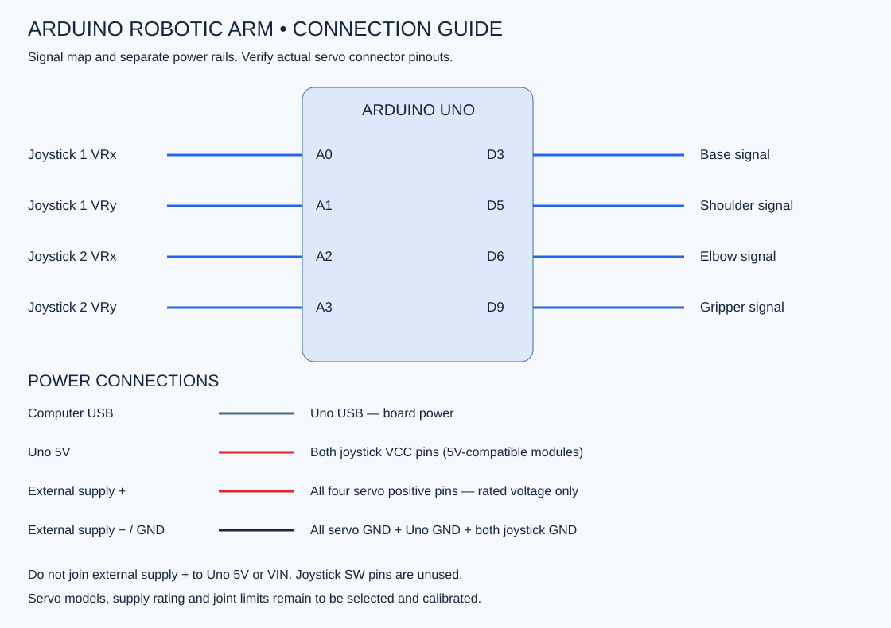

# Wiring and power

Disconnect USB and external power before wiring. Check servo pinouts against their datasheets; wire colours are not guaranteed.

| Connection | Destination |
|---|---|
| Joystick 1 VRx | Uno A0 |
| Joystick 1 VRy | Uno A1 |
| Joystick 2 VRx | Uno A2 |
| Joystick 2 VRy | Uno A3 |
| Both joystick VCC pins | Uno 5V, for 5V-compatible modules |
| Both joystick GND pins | Uno GND |
| Both joystick SW pins | Unconnected |
| Base servo signal | Uno D3 |
| Shoulder servo signal | Uno D5 |
| Elbow servo signal | Uno D6 |
| Gripper servo signal | Uno D9 |
| All servo power positive pins | External regulated supply positive |
| All servo grounds | External supply negative / ground |
| External supply ground | Uno GND |
| Uno USB | Computer USB |

Use a servo supply whose voltage matches the actual servo ratings. Use 5V only if all chosen servos support it. Size supply, switch, connectors and distribution wiring for simultaneous current demand.

Keep external servo positive separate from Uno 5V and VIN in this USB-powered arrangement. Common ground is necessary for a shared signal reference.

## Before applying power
- Confirm supply polarity and voltage with a meter.
- Confirm there is no short between positive and ground.
- Check every signal wire against the table.
- Secure loose wires and detach servo horns for initial calibration.
- Keep the servo supply disconnect within reach; support the arm before cutting power.

Reference: [Arduino servo troubleshooting](https://support.arduino.cc/hc/en-us/articles/360017053760-Troubleshoot-servo-motors).
